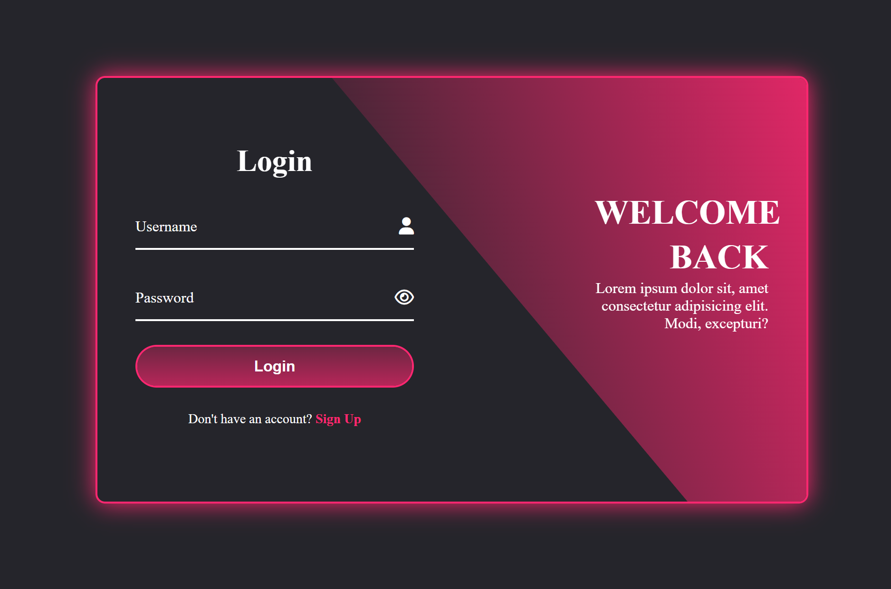
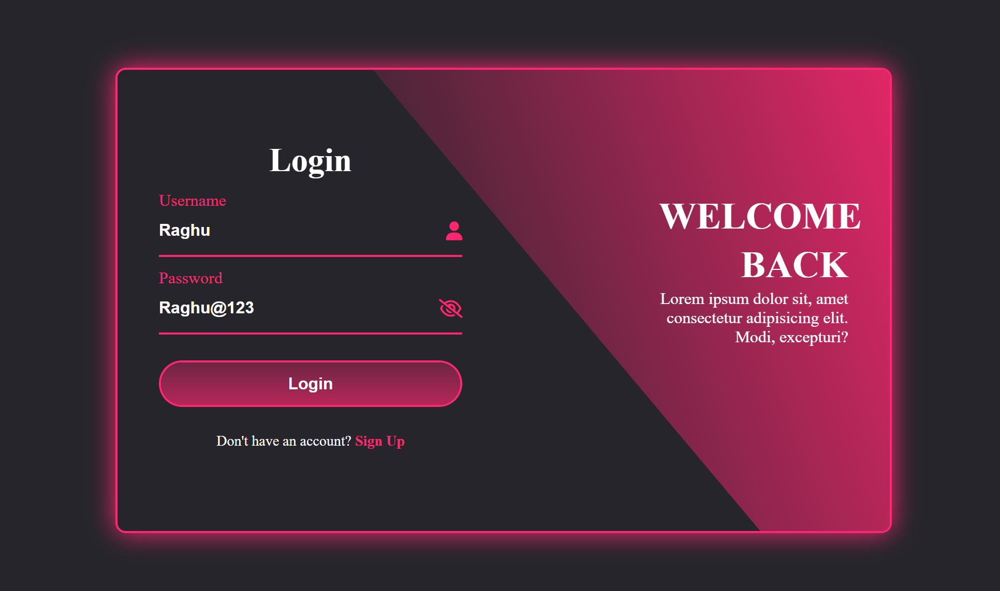
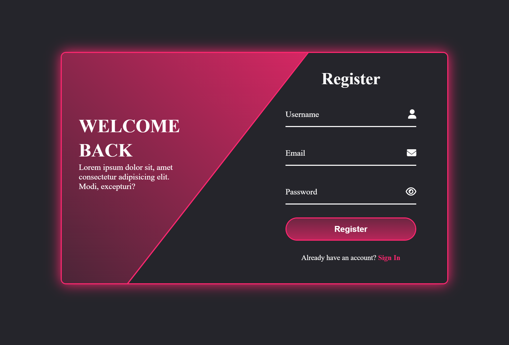
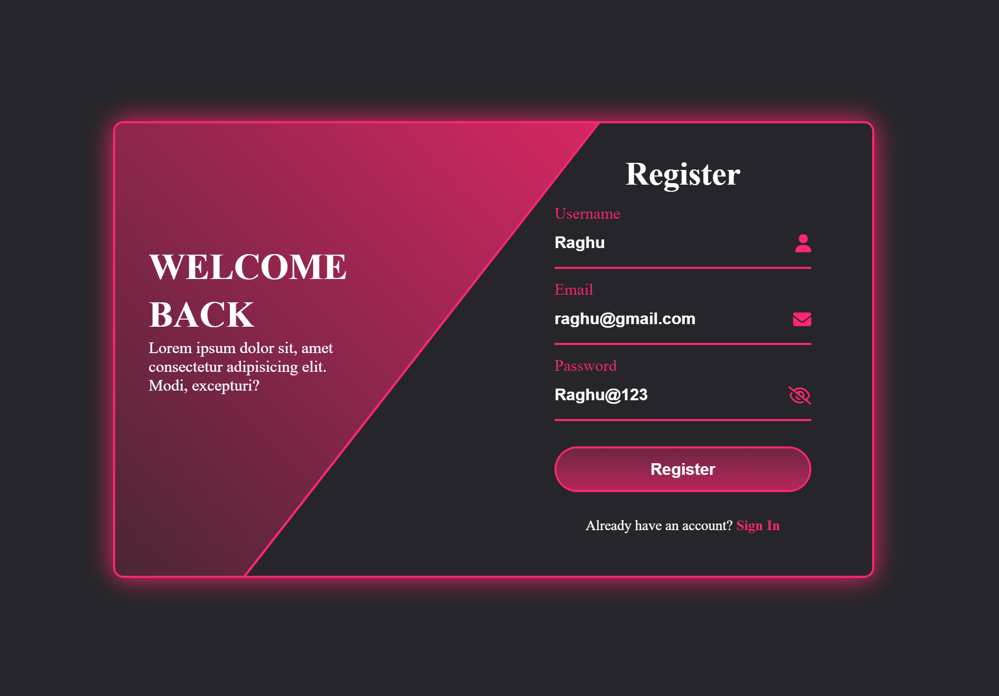

# SignUp-Login-Form

## Description
This project is a visually appealing **signup** and **login** form featuring smooth transitions, built using **HTML, CSS, and JavaScript**. It allows users to navigate through the login and registration processes seamlessly. While the form is designed as a static webpage for demonstration purposes, it showcases a key feature that lets users view their passwords by clicking on an eye icon.

## Features
- User-friendly interface for login and signup.
- Password visibility toggle.
- **Fully animated transitions** for a smooth user experience.
- Responsive design
- Icons used from [Font Awesome](https://fontawesome.com/)

## Technologies Used
- **HTML**
- **CSS**
- **JavaScript**

## Screenshots
### Login Form

### Signup Form

## Usage
- Open the application in your web browser.
- Use the login form to access your account.
- If you don't have an account, click on the signup link to register.

